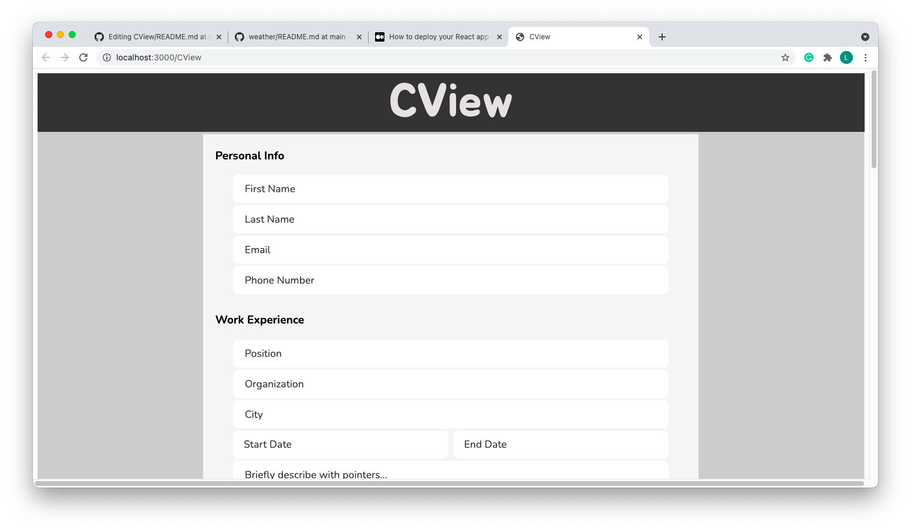

# CView
## Introduction
CView (pronounced See-V-View) is a CV preview generator web application created as part of TheOdinProject syallabus, as practice for ReactJS.
This project is created using HTML, CSS and ReactJS, using class based components.

## Using the Application
### Via GitHub Pages
The web application is hosted on GitHub pages at the following link: https://boonhaii.github.io/CView/.
A sample of the display is as follows: 

To use the application, fill up the details as per prompted by the input fields. The preview PDF shown below should also update as you fill in your information.

Please note the following pointers when creating your CV:
1. For the description field, do describe the activity with a few short sentences. Please note to begin each pointer with a new line if you would like them to be considered as seperate points.
2. For dates, please input them in the MMM-YYYY format to allow the application to render the information properly in the generated preview.

To view a sample of the generated PDF, click on the "Load Example" button.
To clear all fields simultaneously, click on the "Clear" button.
To generate the pdf file, click on the "Generate" button which would display a new print window, and select the "Save as PDF" option.

### Via Local Computer
The web application can also be ran locally on your device. This would require npm to be installed in your local device.
To do so, clone the repo and traverse to the root directory of the repo. In your terminal, run npm start. The web application should open up in your browser.
The steps to generate your personal CV would be same as if accessed from GitHub pages.

## Closing Remarks
The following are the current ideas on future features for implementation:
1. Improve styling of generated PDF CV.

Thank you for checking out my project!
